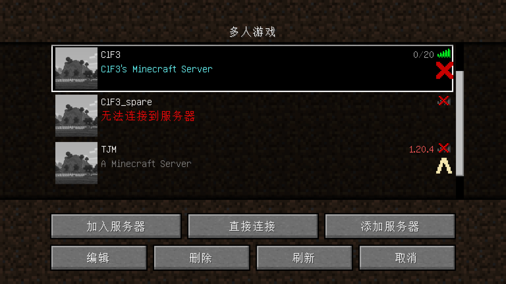

在刚开始折腾服务器时我就尝试开过我的世界服务器，最开始是直接简单粗暴地在Windows系统里运行，后来搬到我的Linux虚拟机上，开一个TMUX运行。但一直不能实现服务的自动启动，无论是Windows的开机启动任务还是Ubuntu的crontab似乎都不能让MC服务器正确的运行。

于是我决定用Docker部署一下我的Minecraft服务器，这样就可以方便地自动启动和重启服务器。我的服务器是1.19.4版本，使用Forge，添加了暮色森林模组，首先也是从Minecraft Docker的[Document](https://docker-minecraft-server.readthedocs.io/en/latest/)上找到一个compose.yaml的模板，然后按照我自己的要求进行了一些修改：

```yaml
version: "3.8"
 
services:
  mc:
    image: itzg/minecraft-server
    tty: true
    stdin_open: true
    ports:
      - "25565:25565"
    environment:
      EULA: "TRUE"
      VERSION: "1.19.4"
      TYPE: FORGE
      # http_proxy: "http://192.168.3.2:10811"
      # https_proxy: "http://192.168.3.2:10811"
      INIT_MEMORY: 1G
      MAX_MEMORY: 4G
      DIFFICULTY: hard
      OP_PERMISSION_LEVEL: 3
      SPAWN_PROTECTION: 0
      ALLOW_FLIGHT: true
      ONLINE_MODE: false
    volumes:
      # attach the relative directory 'data' to the container's /data path
      - ./data:/data
    restart: unless-stopped
```

这里指定了VERSION和TYPE环境变量，设置代理是为了更快地下载Forge，下载完可以注释掉。其他一些服务器参数都可以通过环境变量的方式在这里设定，具体参阅Minecraft Docker的文档。最后一行表示除非手动停止，否则每次开机都重新启动这个Container。要实现这一点，我们还要保证Docker的守护进程能开机自启动：

```bash
sudo systemctl enable docker.service
```

准备好后，我们可以：

```bash
sudo docker compose up -d
```

如果下载过慢，可以换用南大Docker Hub源，方法是打开或创建/etc/docker/daemon.json，在其中添加以下内容

```json
{
    "registry-mirrors":[
        "https://docker.nju.edu.cn/"
    ]
}
```

如果你希望在Docker上开一个新的服务器，那么步骤到这里就结束了。但由于我要保留原先的地图和添加模组，需要在启动后docker compose down关闭这个Docker，再把world文件夹和mods文件夹替换掉，之后重启Docker就能正常运行了。

由于我的服务器有公网IP，所以只需要将外网25565端口映射到这台虚拟机上的25565端口就可以了。如果你没有公网IP，可能还需要内网穿透才能让局域网之外的玩家也能访问。配置好网络后，在游戏里输入对应的IP或域名（如果没有使用25565端口，还需指定端口号），就可以看到我们的服务器了：

