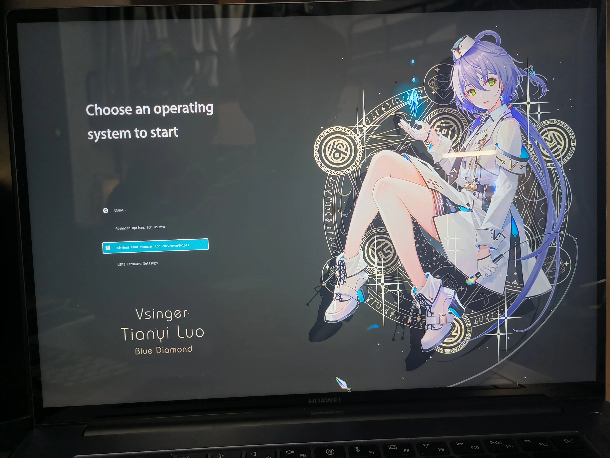

最近给自己的笔记本电脑换了块硬盘，想着既然要从头开始装系统那不如就整一个Windows+Linux双系统。但装完双系统后，每次启动都会进入Grub的系统选择界面。而Grub的默认界面又极其简陋，对高分屏的适配也并不好。因此我萌生了给Grub更换一个主题的想法。

[这个网站](https://www.gnome-look.org/browse?cat=109)上有很多Grub主题，但我找了一圈我也没看到有太合适的。 这时我就想自己做一个Grub主题了，作为一个忠实的锦依卫，这个主题肯定也要包含天依的元素了~

首先我想先了解一下一个Grub主题都应该包括一些什么，于是我在上面的网站上下载了一个星铁的Grub主题看了一下，这个主题包含了下面这些文件：


经过一番研究和查阅[Grub官方文档](https://www.gnu.org/software/grub/manual/grub/html_node/Theme-file-format.html#Theme-file-format)，我大致弄明白了这些东西都是干什么的。icons文件夹放着各个系统的图标，是用在每个系统的选项前面的；background.png是背景图片；selected_*.png是一些贴图，作用后面会讲；最核心的是theme.txt，这个文件包含了这个主题的配置信息，在我下载的这个主题里，theme.txt文件长这样：

```
title-text: ""
desktop-image: "background.png"
terminal-left: "0"
terminal-top: "0"
terminal-border: "0"
terminal-width: "100%"
terminal-height: "100%"
 
+ boot_menu {
  left = 120
  top = 47%
  width = 472
  height = 35%
  item_color = "#cccccc"
  selected_item_color = "#ffffff"
  icon_width = 36
  icon_height = 36
  item_icon_space = 20
  item_height = 40
  item_padding = 2
  item_spacing = 40
  selected_item_pixmap_style = "select_*.png"
}
 
+ label {
  left = 120
  top = 83%
  align = "center"
  id = "__timeout__"
  text = "Selected OS will start in %d seconds"
  color = "#cccccc"
}
```

最开始的一段是一些全局属性，title-text是标题，显示在上方中央的位置；desktop-image指定了背景图片，terminal-left和terminal-top则指定了Grub Terminal的左上角的位置，terminal-width和terminal-height就是Terminal的宽度和高度。这些宽度、高度和位置的指定都支持使用像素或者百分比或者两者混合，例如"12%+100"。下文提到的宽度、高度和位置也同理。

下面的boot_menu和label是两个组件(component)，boot_menu就是给出选项的启动菜单，而label代表你希望自定义显示的一段话。每个组件有自己的属性，其中left, top, width, height含义和全局的类似，就是表示左上角的位置以及组件本身的长宽。item_color和selected_item_color顾名思义，就是每一项的文字默认颜色以及被选中时的颜色。下面一些项指定了图标的长宽，项目文字和图标的距离，项目之间的距离等等，具体可以查阅官方文档，在此不再赘述。而selected_item_pixmap_style是一个非常有意思的东西，它相当于通过9张小图片指定了一个item的四角、四边以及内部应该用什么样的贴图，我们需要给它9张后缀分别为c, e, n, s, w, ne, nw, se, ew的小图片，Grub就会自己把它们拼成一个完整的背景用在这个item上，selected_item_pixmap_style则表明仅有被选中的item适用这个贴图。

label组件的各种东西是类似的，需要注意的是id设为"__timeout__"就可以使用%d在文字中代表剩余秒数。

知道了这些之后我们就可以开始创建自己的主题了,首先我们需要准备一张背景图片，从我的天依图库翻了翻，最后决定还是这张：


在PS里简单截取拼接之后我们就得到了下面的图片，由于Grub的字体比较有限，而且大小也很难调整，所以我选择将标题做到背景图片里：


这就是背景图了，为了让选中项有一些特殊效果，我需要自己制作selected_item_pixmap_style使用的那九张贴图，其实也很简单，在PS里创建一张5*5像素的小图片，然后填色就行了。我用的是#66ccff的天依蓝，加了不同的透明度，边框是白色。这是右上角的图片(select_ne.png)在PS里的效果：


之后只需要调整一下各个元素的位置和间距，然后就大功告成了！效果的话可以看下面这张图（主要是实在想不出如何把Grub的界面截屏，只有拍屏了）：



完整的配置文件我开源在了[Github](https://github.com/ClF3/tianyi-grub-theme)上，大家可以自行查看。下面再来讲讲怎么使用Grub主题，这里以Ubuntu为例，其他发行版可能在文件路径和命令上存在一些差异。首先创建主题目录，然后从我的Github或者Gitea上下载主题：

```bash
mkdir -p /boot/grub/themes
git clone git@github.com:ClF3/tianyi-grub-theme.git /boot/grub/themes/tianyi    # 使用github，可能需要科学上网
git clone https://git.clf3.org/tianyi/tianyi-grub-theme.git /boot/grub/themes/tianyi    # 使用gitea，可能不稳定
```

然后打开/etc/default/grub，在这个配置文件中添加下面的内容，用来指定Grub主题文件的位置：

```
GRUB_THEME="/boot/grub/themes/tianyi/Tianyi/theme.txt"
# 对于1080p屏幕
GRUB_THEME="/boot/grub/themes/tianyi/Tianyi_2k/theme.txt"
# 对于2520*1680屏幕
```

在配置文件里指定好新主题的位置后，我们运行下面的命令重新编译Grub：

```bash
sudo update-grub
```
之后重启电脑就可以看到新的Grub主题了。
