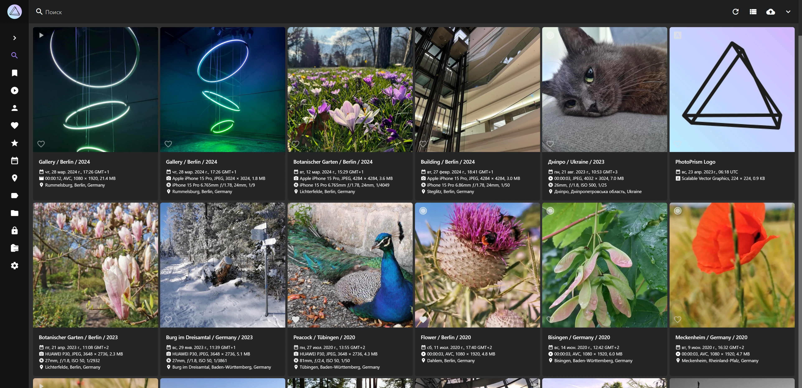
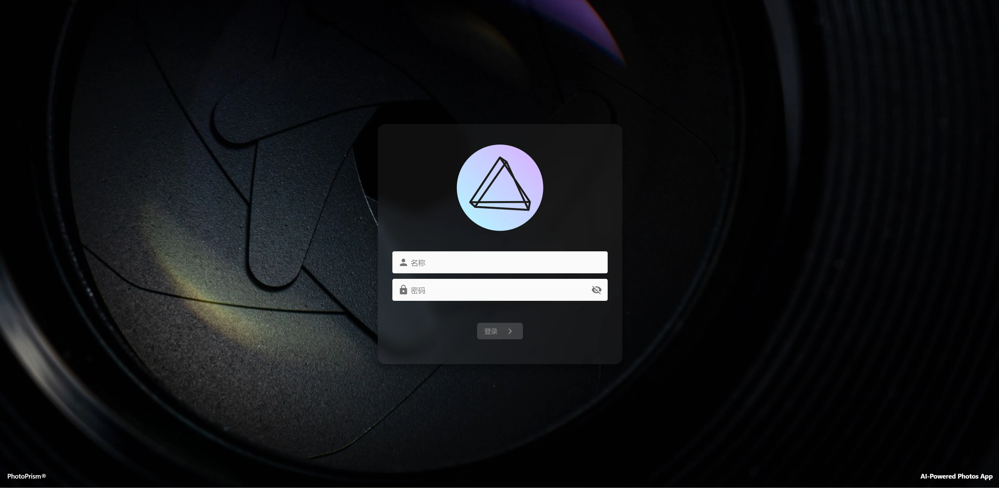
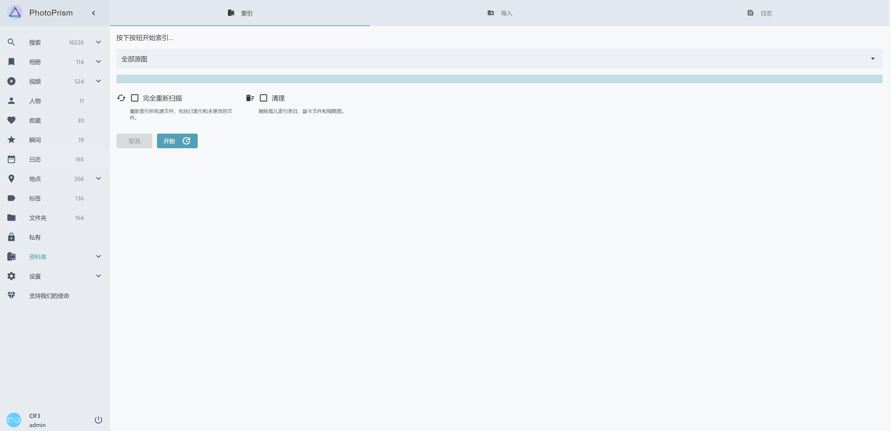
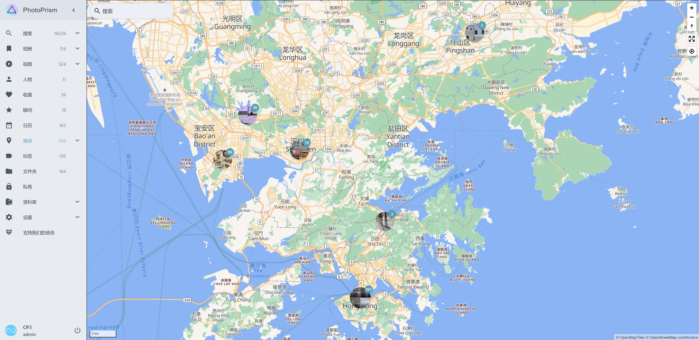

前几天（其实已经是上个学期了）Yoghurt Lee给我看了一个照片管理的开源项目：[Photoprism](https://github.com/photoprism/photoprism)。突然想起我家的各种照片，从零几年的卡片机到近几年手机拍的都有。虽然我爸和我已经在包括电脑硬盘、ownCloud网盘、移动硬盘和百度网盘在内的多种存储介质上备份了我家的照片，但这些照片仍然缺乏有效的整理，查看起来也不那么方便。看到有Photoprism这种Self-hosted的照片管理，支持按时间分类、按识别结果自动分类、照片地图、人脸识别等许多功能，我一颗折腾的心又一次按捺不住了，于是开始在我的服务器上部署。



我所使用的是一台Ubuntu 22.04 LTS系统的虚拟机，考虑到Photoprism对计算有一定要求，我分配了16个vCPU和4G内存，硬盘是1.2T。为了方便之后可能的迁移，我决定使用Docker，这样以后需要迁移的时候只需要把数据文件夹复制过去，再重新Docker compose就可以了。我们首先安装Docker：

```bash
# Add Docker's official GPG key:
sudo apt-get update
sudo apt-get install ca-certificates curl
sudo install -m 0755 -d /etc/apt/keyrings
sudo curl -fsSL https://download.docker.com/linux/ubuntu/gpg -o /etc/apt/keyrings/docker.asc
sudo chmod a+r /etc/apt/keyrings/docker.asc
 
# Add the repository to Apt sources:
echo \
  "deb [arch=$(dpkg --print-architecture) signed-by=/etc/apt/keyrings/docker.asc] https://download.docker.com/linux/ubuntu \
  $(. /etc/os-release && echo "$VERSION_CODENAME") stable" | \
  sudo tee /etc/apt/sources.list.d/docker.list > /dev/null
sudo apt-get update
sudo apt-get install docker-ce docker-ce-cli containerd.io docker-buildx-plugin docker-compose-plugin
sudo systemctl enable docker.service
```

上面代码的最后一行是启动Docker服务，这样你的容器才能自动启动。如果安装太慢，可以换用清华源。安装好之后，新建一个目录，配好docker-compose.yml文件。我是按照官网给的示例文件配的，只把restart: unless-stopped一行取消了注释（这样可以保证容器开机自动启动）。

随后我们便可以启动Docker：

```bash
sudo docker compose up -d
```

第一次compose up会拉取Docker镜像文件，这一步如果过慢，可以换用南大的Docker Hub源，方法是打开或创建/etc/docker/daemon.json，在其中添加以下内容：

```json
{
    "registry-mirrors":[
        "https://docker.nju.edu.cn/"
    ]
}
```

然后重新compose up，速度就会有明显改善。启动Docker后，由于配置文件里Photoprism使用的默认端口是2342，这时curl localhost:2342，已经可以获取到一些内容了。接下来我们只需要在服务器软件里配置转发到对应端口就可以实现标准端口的公网访问了，如果你和我一样，使用的是Apache 2，而且打算启用HTTPS（SSL证书申请可以看Let’s encrypt的教程），那可以参考下面的配置文件：

```
<VirtualHost *:80>
        ServerName your.domain
        RewriteEngine On
        RewriteCond %{HTTPS} off
        RewriteRule ^ https://%{HTTP_HOST}%{REQUEST_URI}
</VirtualHost>
 
<VirtualHost *:443>
        ServerName your.domain
        SSLEngine on
        SSLCertificateFile your/certificate
        SSLCertificateKeyFile your/privkey
        RewriteEngine on
        RewriteCond %{HTTP:Upgrade} websocket [NC]
        RewriteCond %{HTTP:Connection} upgrade [NC]
        RewriteRule ^/?(.*) "ws://localhost:2342/$1" [P,L]
        ProxyRequests off
        ProxyPass / http://localhost:2342/
        ProxyPassReverse / http://localhost:2342/
</VirtualHost>
```

注意，中间几行的Rewrite是对websocket的转发，Photoprism的一些功能需要websocket。如果websocket没有被正确配置，Photoprism网页的侧栏会出现相关提示。如果你使用的是nginx，那配置也是类似的：

```
server {
    listen 443 ssl;
    listen [::]:443 ssl;
    server_name your.domain;
    ssl_certificate your/certificate;
    ssl_certificate_key your/privkey;
    client_max_body_size 50G;
 
    location / {
      proxy_pass http://localhost:2342/;
      proxy_set_header Host $http_host;
      proxy_set_header Upgrade $http_upgrade;
      proxy_set_header Connection upgrade;
      proxy_set_header Accept-Encoding gzip;
    }
}
server {
    listen 80;
    listen [::]:80;
    server_name your.domain;
    rewrite ^(.*)$ https://${server_name}$1 permanent;
}
```

接着我们重启Apache，再在DNS服务商那添加一条域名解析记录，我们就可以访问到Photoprism的页面了：



按照我们在docker配置文件里写好的账号密码，我们可以登录Photoprism。Photoprism支持从网页上传图片，也可以导入存放在本地import目录的图片文件。



Photoprism会对导入的图片进行重新编目，这些图片文件会被求算哈希并去重，之后所有的图片会被统一命名，存在original文件夹中。同时Photoprism会读取照片的EXIF地理位置信息，并根据拍摄位置把照片显示在地图上，当你放缩地图的时候，不同时间、地点的照片还会自动合并和展开，这个功能还是很惊艳的：



除此之外，Photoprism还有人脸识别和场景识别功能，能识别出照片里的人脸和照片所属的场景（不过准确度只能说差强人意），并根据人物或或场景对图片进行归类。当然，作为一个相册软件，Photoprism也支持手动创建相册，收藏图片。

Photoprism的照片预览同样很快（似乎是通过预先生成thumbnail图的方式实现的），在浏览大量图片的时候也能非常流畅。但是如果你的图片很多，那你点进其中一个查看原图的时间还是比较长的。（但是如果在查看原图界面连续浏览后面的图片，加载速度也很快，只有刚点进去的那一次比较慢。）

此外，值得一提的是，Photoprism对系统配置的要求还是比较高的（似乎是因为需要本地跑AI推理来实现人脸识别和场景识别），如果一次上传上千张图片，那上传后的索引时间也是挺长的。我给我的这个虚拟机分配的4G内存最多只占用2G左右，但索引的过程中16个CPU核心都会被占满。（我已经能想象到我那台E5服务器的咆哮声了。）如果使用NAS运行这些东西，可能会有点费劲。

总的来说Photoprism的效果还是很令人满意的，接下来一段时间我都会用它管理我们家的照片。最后附上经典人工智障图：


