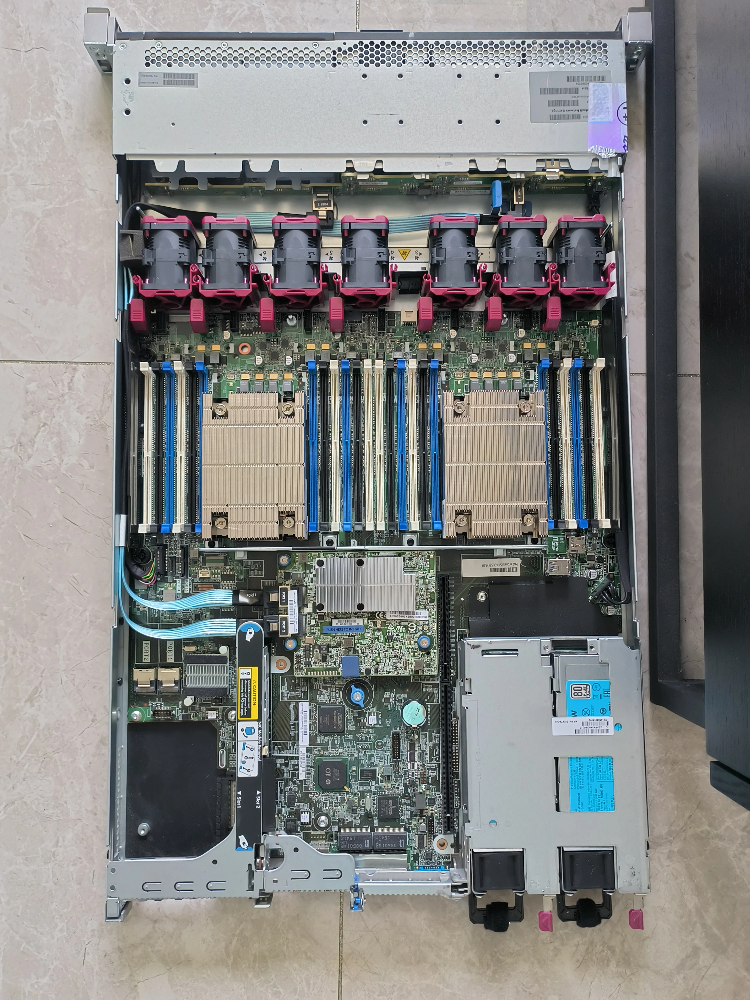
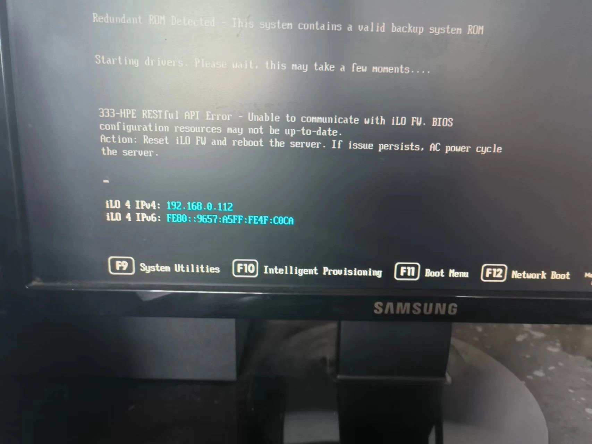
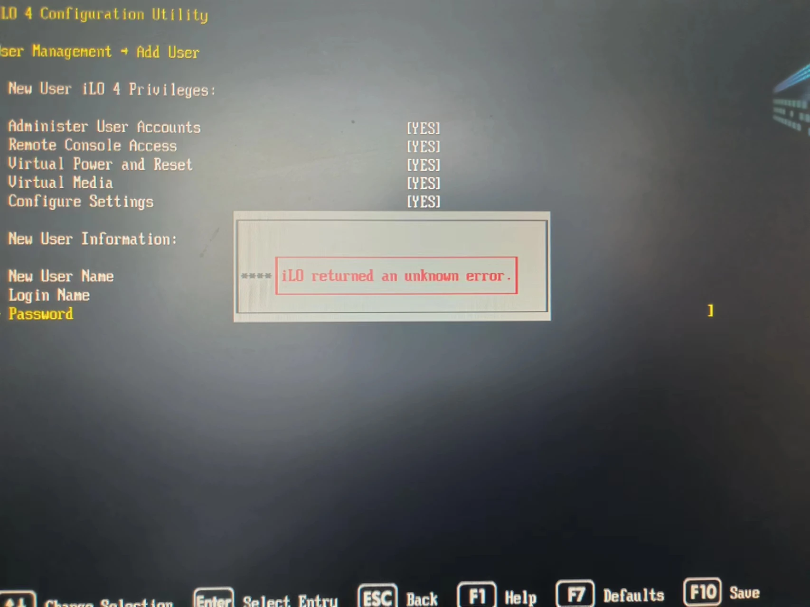
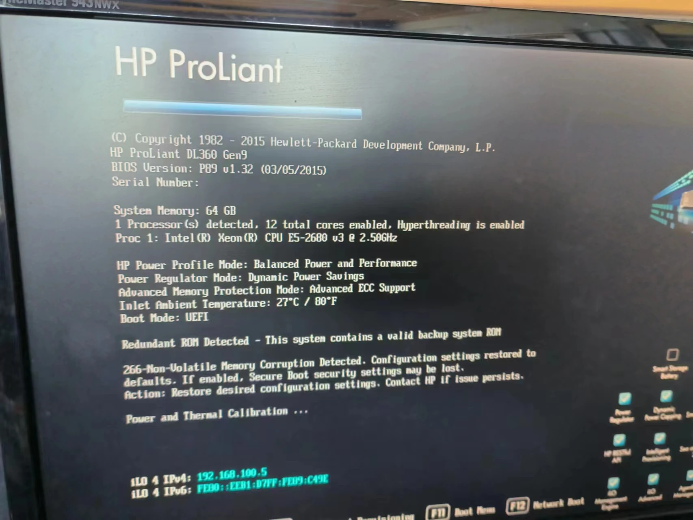
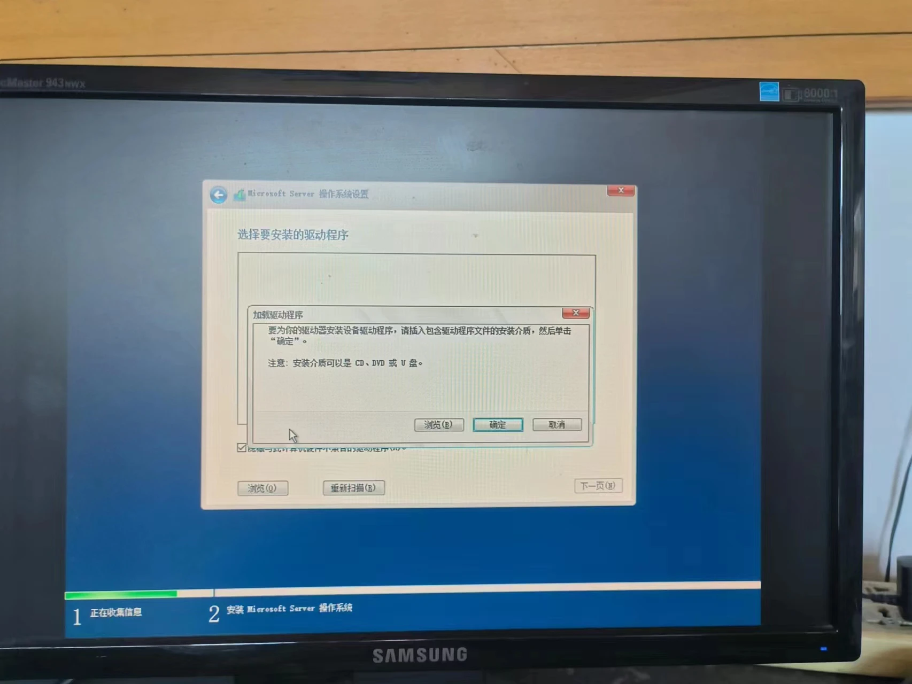
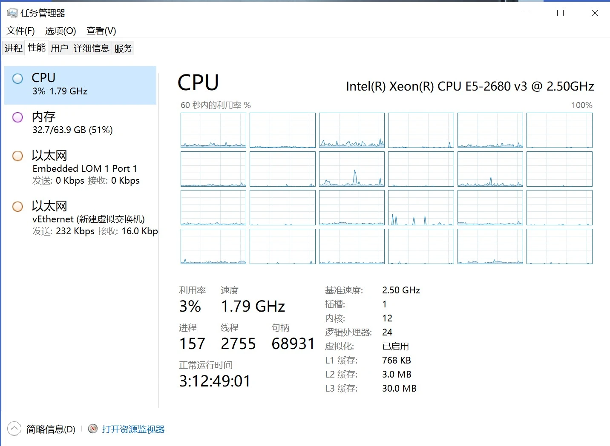
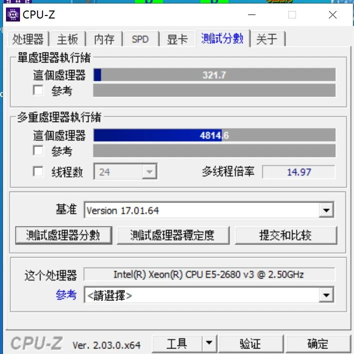
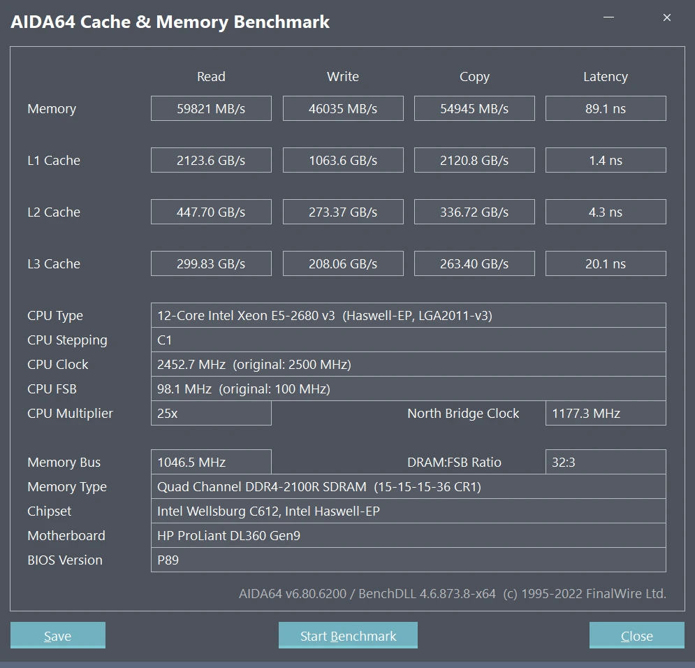
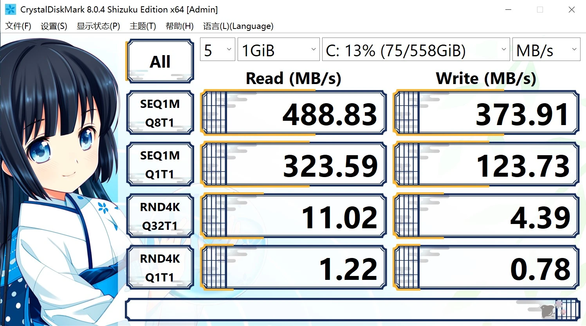
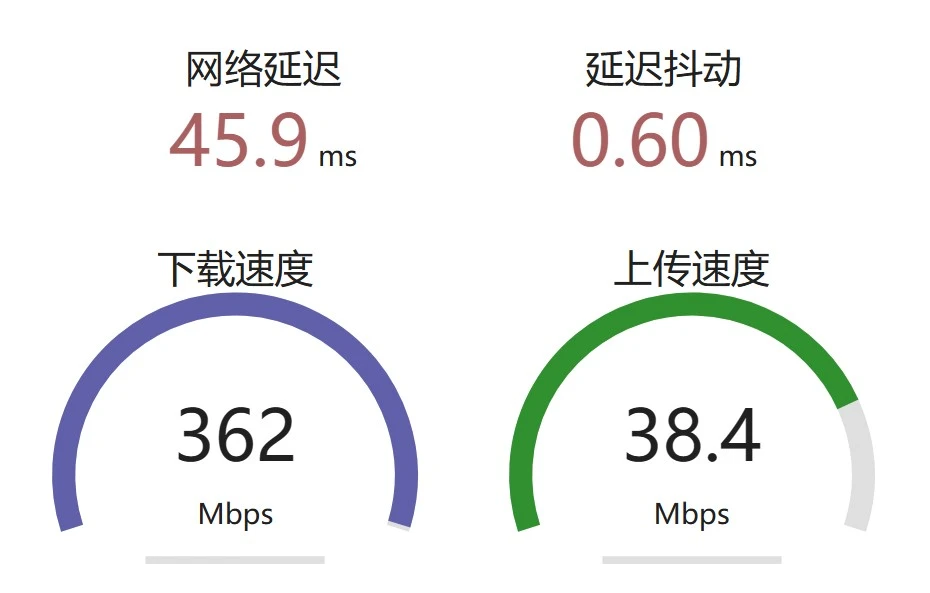

之前在和同学玩Minecraft的时候想到整一个专用服务器，正好我也希望搞一个个人博客和其他的一些东西（网盘、邮件服务器、一些实用工具网页等等），而国内云服务器的价格又很高（尤其是带宽），因此就有了自己在家整一个All in One的服务器的想法。

因为整个服务器都是实验性质的，所以也就不考虑All in Boom的问题了，简单来说就是坏了拉倒（

也正因如此，在服务器的选型上我决定捡一捡垃圾，好控制一下成本。一开始考虑过搞一个Dell的小主机，但是因为性价比不高而且后来不打算放宿舍就放弃了。之后想过自己组一个X99平台的台式机，用洋垃圾CPU和ECC内存。但转念一想，我本来不就是想搞一个服务器吗，为什么不一步到位捡一个X99平台的机架式服务器呢？比较了一下价格，感觉甚至比自己组装更有性价比，于是这成为了我最终选定的方案。

经过一番比较，我最终确定了如下的配置：

| 准系统        | 惠普DL360 Gen9                 | 300-500 |
| --------     | --------                       | ------ |
| CPU          | 2*至强E5 2680V4（之后换成1*V3了） | 150|
| 内存          | 4*16G DDR4 ECC内存             | 300 |
| 硬盘          | 4*300G SAS硬盘                 | 90 |

这一套东西都很有年头了，其中最年轻的部件生产日期也是2016年，可以说是名副其实的电子垃圾。当然，这些东西都是企业级的，当年发售的时候价格也极高，这一整套配置的价格在当年要以万为单位，如果不是被淘汰成了电子垃圾，想必我也是没有机会拥有的。

说回正题，东西全收到后我立刻开始了组装，这些部件的安装难度其实并不高，首先打开服务器的顶盖：

把两个散热器取下就是CPU插槽，安装好CPU和内存都还很简单，但装硬盘的时候我遇到了一点麻烦，服务器的硬盘需要硬盘架才能插到前置的硬盘位上，而这个东西的硬盘架居然意想不到的贵（具体来说我的一块硬盘22，一个盘架要30以上），作为一个垃圾佬，这是我绝对不能接受的，所以我决定不用盘架装好硬盘，也就是手动对准插槽直接插上去，事实证明这也是可行的。

但开机后我遇到了一个意想不到的问题，惠普的服务器需要通过iLO进行管理，但这台机器的iLO似乎有点问题。具体而言，机器启动就会报一个iLO的错误，同时修改iLO的密码时也会显示未知错误：

这让我非常头大，我尝试了各种手段：重启、断电重启、重置iLO、把整个机器恢复出厂设置，但都没有用，询问了店家也不知道原因，最后只能退货在另一家重新买了。

新机器又出现了新问题，这台机器的BIOS版本是15年的，而E5V4系列发布于16年，因此这个BIOS与CPU并不兼容，现在摆在我面前的是两个选择：升级BIOS或是换一个更老的V3CPU。在一番寻找过后，我找到了一些升级BIOS的文件，但感觉并不是很靠谱的样子。因为怕损坏BIOS而把服务器弄坏（当时并不知道主板上有备用BIOS），于是决定买一个能兼容的CPU，因为两代CPU性能差距并不大。

把新（旧？）CPU装好后总算能正常进BIOS了，但又有新的问题，机器完全不认盘，新的这台机器阵列卡被拆掉了，硬盘是直插主板的，不知道这是不是不认盘的原因，于是只好买一个阵列卡再试。

阵列卡装好后，进入SmartArray存储管理，可以认到盘了，把4块硬盘格式化再组一个RAID10，这样一来可以保证盘坏一块系统仍正常运行（运气好的话甚至可以坏两块），一共600GB的空间也完全够用了。但很快又有了新的问题，Windows server安装盘并不能识别这个硬盘阵列，非要我装什么驱动

不过好在，我有另一个PE系统盘，进PE后可以认到硬盘，这样一来我就可以用DiskGenius分区后再用PE系统自带的工具装系统了。

折腾了半天，总算装上了系统，之所以用Windows server主要是因为有GUI，个人还是不太习惯完全没有GUI的东西，而且考虑到我的两个主要需求：MC服务器和WordPress博客都可以在Windows上正常运行，其他需求完全可以用Linux虚拟机实现。

装好系统后简单测试一下性能，首先是CPU，E5-2680V3，14年的古董了，用CPU-Z跑一下分，多核比我的笔记本i7-12700H差了一点，单核嘛……还不到12700H的一半，但30块的东西，也不能奢求太多了。

然后是内存，4条DDR4 ECC内存，频率2133。用AIDA64的内存及缓存测试跑了一下，不过内存相关的参数我也不是很了解，也就看个乐吧。

之后是硬盘，硬盘使用了4块戴尔服务器的拆机盘，每块300G，因为年限实在太久（十年左右），怕出问题，所以组了一个RAID10阵列，也就是最后大概有600G的空间可用，速度理论上是单块硬盘的2倍，测试见下图：

可以看到，顺序读写性能已经接近SSD固态的水平了，但4K读写嘛，就完全没法看了。不过机械硬盘嘛，这倒也正常。

最后就是简单测一下网速了，使用中科大的测速网站，结果出人意料，下载竟然有360Mbps，要知道我印象里这边一直是百兆宽带。问了一下才知道联通之前免费给我们家升级过宽带。不过上传仍然是40Mbps的小水管，但对于我这种使用需求来说也够了。

