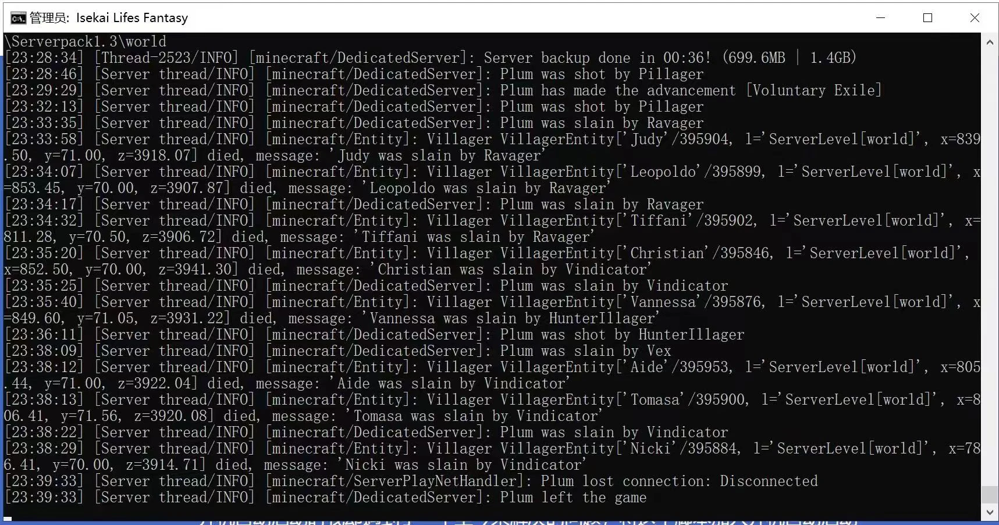
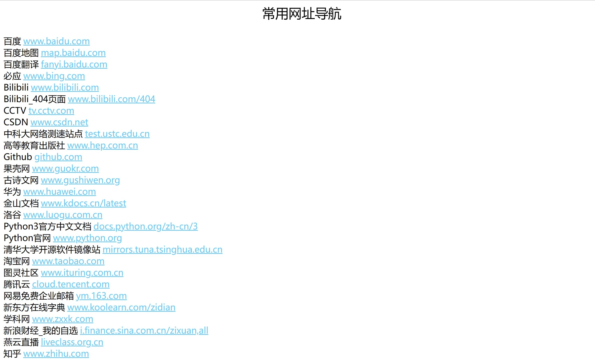
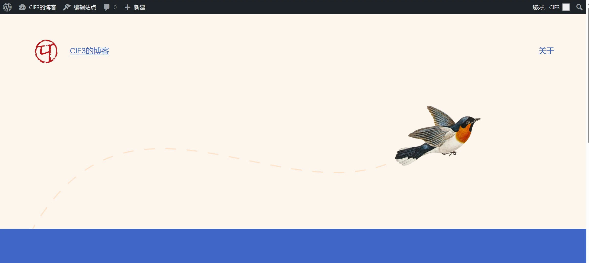

硬件方面的问题解决完，系统也已经装好了，下面就该在我的服务器上真正的部署一些服务了。

首先最好解决的应该是我的世界服务器，要装的是一个大型整合包，只需先装好JDK 11的环境，再将整合包解压并运行其中的批处理脚本即可，非常的简单。但设置开机自动启动时我却遇到了一个至今未解决的问题，将这个脚本加入开机自动启动的计划中似乎并不能保证服务器重启时自动加载MC服务器，具体原因还不清楚。



启动MC服务器后，还需要保证它可以被外网上的其他人访问，由于我家的宽带有动态的公网IP且是路由器拨号，因此只要在路由器上手动设置将外部25565端口映射到内网服务器的25565端口，再将服务器的MAC地址与IP绑定，防止DHCP导致内网IP变动。而为了保证域名始终解析到我的动态公网IP，我在服务器上进行了DDNS，即用一个Python脚本定时修改域名的DNS记录，以保证域名始终解析到当前IP。

然后是远程桌面，这也很好办，防火墙放通3389，设置里打开远程桌面功能即可。出于安全考虑，我打算修改一下远程桌面的端口，但是无论怎么按照教程操作，改完之后都无法连接成功。后来我想到了一个的方法，服务器这维持3389不变，但路由器这边用别的公网端口映射到服务器的3389上就可以了。

考虑到一般的服务器都是使用Linux系统，我也打算在机器上搞一个Linux虚拟机，于是我在服务器管理器上为服务器安装了Hyper-V，并在其中安装了一个使用Ubuntu server系统的虚拟机，网络模式这里选的是连接在虚拟交换机下，也就是和Windows服务器位于同一级的关系，这样路由器就能直接给我的Linux服务器分配一个内网IP。为了远程访问我的Linux虚拟机，我设置好了SSH，并在路由器防火墙上放通了自己设置的SSH端口。

之后就是作为一个服务器的必备业务，也就是网页服务。这里我决定使用Cloudflare提供的tunnel实现内网穿透，而不是直接暴露公网端口，一方面是出于安全考虑，另一方面是为了防止运营商发现我用家宽提供web服务而找我的麻烦。在服务器上安装好Cloudflared，之后在Cloudflare的dashboard上配置好tunnel，并让本地的Cloudflared连接到这个tunnel。运行网页服务我一开始采用的是Windows server的IIS功能，这样就可以在本地的一些端口运行http服务，再用tunnel转发到公网上。出于安全考虑，我决定使用Cloudflare的http强转https功能，这样我的所有页面都是https的加密传输，我到Cloudflare这一段是经过私有的tunnel，可以保证安全，而Cloudflare到用户则是使用Cloudflare自己的证书进行验证。

做好之后我就成功在公网上呈现了一个极为简陋的网页：

[https://nvg.clf3.org](https://nvg.clf3.org)



之后如果想实现一点更为复杂的东西，就要写一些更复杂的HTML、CSS和JS了。所以为了一步到位，我决定安装WordPress，让这一切都可以自动生成，从而搭建起一个自己的博客。

根据WordPress的官方指引，我需要安装好PHP和MySQL，Web服务器软件也最好用Apache。在网上搜索了很多安装的教程，也尝试过很多次自己配好Apache+PHP+MySQL的环境，但最终都以失败告终。正当我不知所措的时候，发现其实有类似WAMP这样适用于Windows端的Apache+PHP+MySQL集成环境，这简直是我这种技术力不是特别高的懒人的福音。我于是开始搜索WAMP的安装教程，这次非常顺利，一次就成功了。WAMP正常运行后，我将WordPress放入WAMP的www文件夹下，用浏览器访问这个文件夹，按照网页上的提示完成了WordPress的配置。终于，我看到我的第一个博客页面在localhost上成功发布了，当时我的心情可以说非常激动了。



我在tunnel中将blog.clf3.org映射到了localhost的80端口，并从外网访问了我的博客主页。但我很快发现了新的问题，许多图片和资源都无法正常加载，经过对这些元素的Inspect，我发现它们都指向localhost下的一些资源，也就是说客户端其实在企图从自己的localhost获得这些资源，那当然是不可能的。

看起来WordPress加载这些资源用的是绝对路径，这让我挺无法理解的。为了解决这个问题，我查阅了很多资料，但都没有得到满意的答案。最终，我在仪表板中设置一项找到了站点URL和WordPress URL的选项，我将二者都更改为blog.clf3.org，并在服务器hosts文件中加入将blog.clf3.org指向回环地址的项。这样一来，我在服务器上访问blog.clf3.org相当于直接访问localhost，而在客户端也可以用这个域名通过Cloudflare和tunnel访问到我的页面。

但是仍有一个问题没有解决，那就是从客户端访问时图片会加载不出来。并且如果单独访问图片其实是可以加载出来的，但是页面中却并不会加载这张图片，手动重载也不行。

再进行元素检查后我找到了原因：正常情况下，Cloudflare会把我的博客的http重定向到https，但博客中的资源并不会被重定向，仍是http，对于这种混合内容，大多数浏览器都会进行拦截，也就加载不出图片了，而当我单独打开图片时，Cloudflare又会把http重定向到https，也就又可以访问了。

但是现在我其实也不是很能理清经过了Cloudflare之后各段用的到底是http还是https，所以就先把WordPress站点URL都改成带s的，又按照网上的说法在config文件里加入了下面3行：

```
$_SERVER['HTTPS'] = 'on';
define('FORCE_SSL_LOGIN', true);
define('FORCE_SSL_ADMIN', true);
```

之后把hosts里面那个DNS记录删掉就可以了，现在无论我本地管理还是其他人远程访问都是先走Cloudflare再到我这边。大家到Cloudflare肯定是https，从Cloudflare到我服务器的localhost用的tunnel，不知道里面是什么形式，localhost这肯定是http，但WordPress似乎还以为这是https？反正最后大家都能正常运行，只有我的脑子里有点混乱（

最后搞好的效果就是我们现在看到的这个博客，只能说看起来还比较像那么回事，但是很多细节还不是很完善。