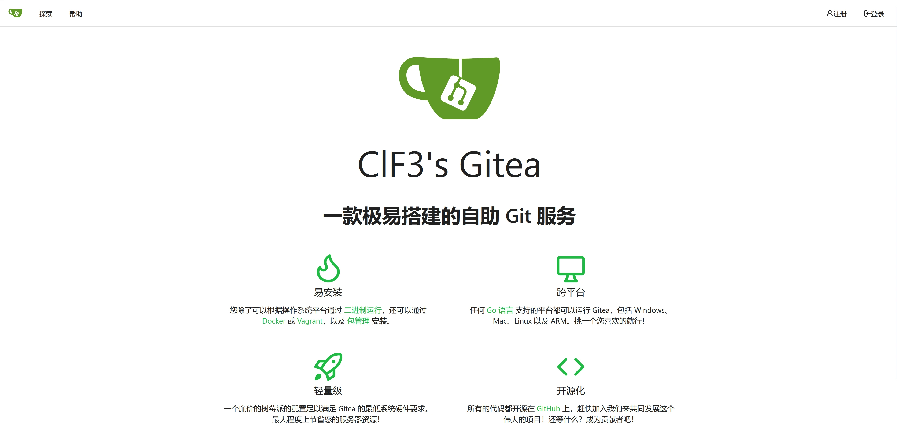
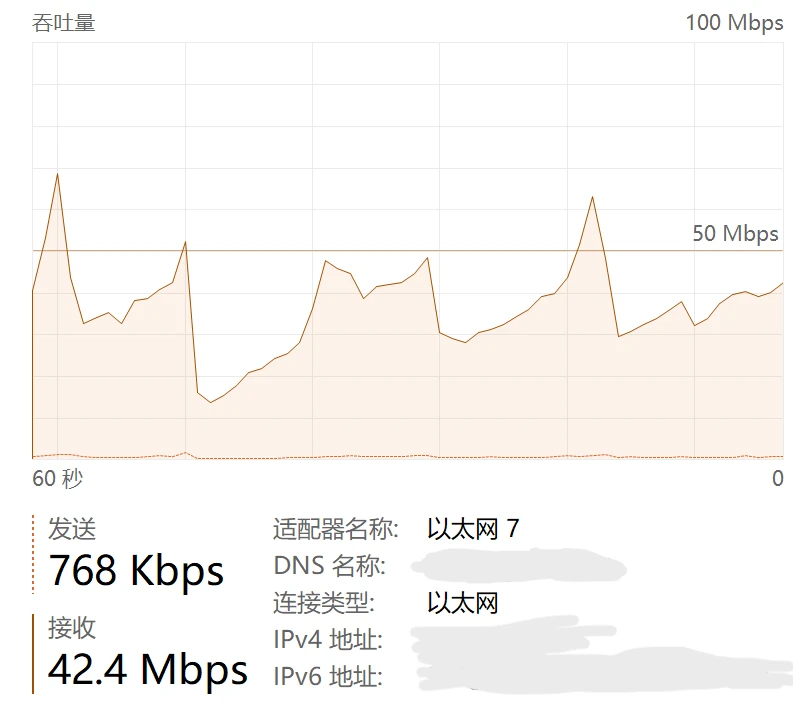
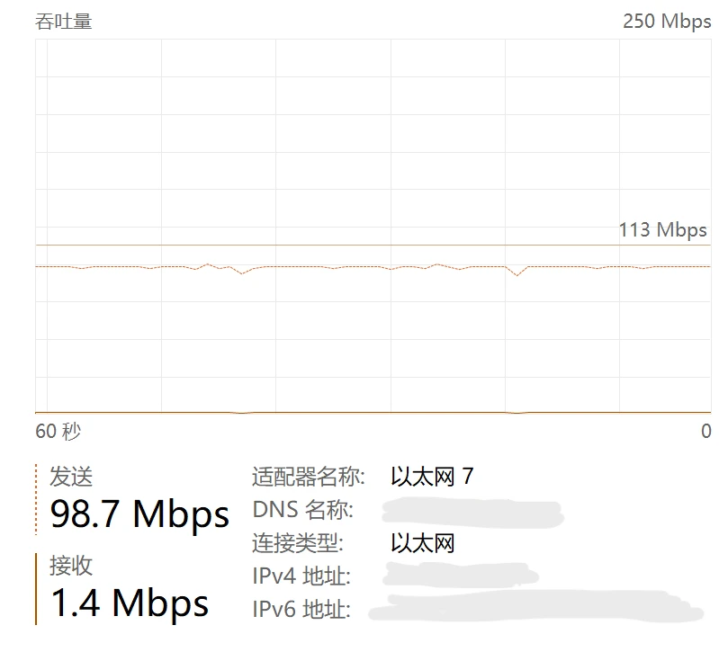

本着物尽其用的原则，我决定在我的服务器上添加更多的服务，首先，我想搭建一个属于自己的Git服务器。这里我选择了Gitea，因为它安装非常简单，功能也比较全面。

Gitea是支持Windows端的，所以我打算直接在我的Windows Server机器上搞。首先为Gitea创建一个数据库，因为之前已经装好了WAMP的集成环境，所以我们只需要进入MySQL的管理后台，新建一个数据库就行了。


在正式开始安装之前，我们首先要在服务器上安装Git，安装后也不需要进一步的操作，只要有Git的环境就可以了。

接下来我们把下载下来的exe文件放到一个空文件夹里，然后运行，接下来会弹出一个cmd窗口，提示已经在localhost:3000开启了服务器，接下来就是访问这个网页，按照相应的提示完成配置就行了。然后在Cloudflare Dashboard上添加一条转发到localhost:3000的记录就可以了，整个过程和Wordpress的安装很类似。安装好的效果就是下面这个网页：

[https://git.clf3.org/](https://git.clf3.org/)



接下来我打算整一个个人网盘，经过一番比较我选择了Alist，因为在各家的免费方案中，Alist提供的功能算是其中比较丰富的了，而且安装同样很简便。但是Alist没有Windows版，所以我只能在我的Linux虚拟机上搭建Alist服务了。

Alist官方提供了一键安装脚本，可以直接完成所有的安装和配置，运行一键安装脚本后，程序本体默认在/opt/alist目录，而服务器默认开放在localhost:5244端口，一开始打开时未挂载任何文件，因此目录是空白的，在管理-存储界面可以添加存储。理论上除了挂载本地目录还可以挂载各种网盘的内容，而我目前只是把本地的一个文件夹挂载到了Alist的根目录。其实Alist本质上是一个文件列表程序，主要就是提供一个网页，把本地或者其他地方的文件展示出来，供下载和上传。

我在自己的Alist根目录建了一个名为share的文件夹，并尝试上传、下载了一些文件，工作都很正常。


但我很快发现了Alist的一个硬伤，比起网盘，Alist的定位其实更类似于一个分享文件的平台，因此它在很多方面对文件的私密性考虑不够好。正常的网盘是每个用户使用不同的存储空间，分享时单独生成分享链接，但Alist对所有用户甚至未登录的访客默认都是列出所有文件。即使我设置了只有我一个用户，并禁用了访客，问题仍然存在：同一个文件的下载链接可以在互联网上的任何一个地方使用，Alist在提供下载时并不会检验Token或者类似的东西，而是来者不拒。更要命的是，Alist的下载文件链接格式和文件绝对路径高度相关，也就是说，只要知道我的文件的绝对路径，任何人都能下载它。

为了解决这个问题，我的选择是不将我的文件直接放在根目录之下，而是放在一个名称极长的文件夹中，让这个文件夹名称起到密码的作用。当我需要分享一个文件的时候，再手动将其放到这个文件夹外的share文件夹中。但总感觉不是很安全的样子，而且很麻烦。

此外还有一个问题：Cloudflare的服务在中国大陆可谓是减速器。我尝试用我的服务器ping分给我的Cloudflare节点，时间都超过300ms，而且丢包很高，tracert看了一下是走到美国去了。用Cloudflare的服务做一做博客或者Git这种对带宽和实时性要求都不高的东西还可以，但网盘这种东西用Cloudflare转发就有点难受了，但考虑到我们家其实是有公网IP的，可以对公网开放一个高位的端口来做我的网盘。于是我在路由器里配置了转发，之后实测上传文件可以突破百兆，下载也有接近40Mbps，也算是能用了。





这时我发现当时给Ubuntu虚拟机留的硬盘空间过小，只有64G，稍微装一点大文件我的Alist就满了。于是我决定扩容虚拟机硬盘。

首先在Hyper-V里扩充虚拟磁盘的容量，这一步是非常简单的。但这样扩容之后，系统并不能立刻识别到扩大的这部分容量，因为磁盘分区仍然是按照64G来分的，因此我们用parted修改一下分区表，把主分区调整到255GB。

首先用print命令查看当前硬盘分区情况：

```bash
sudo parted /dev/sda print
```

这样我们就能看到各个分区的起止位置，下面修改一下主分区的终止位置，把所有的磁盘空间用上：

```bash
sudo parted /dev/sda resizepart 3 255.0GB
```

接下来我们用lsblk就会发现，分区sda3的大小确实变成了255G，但上面的物理卷以及Ubuntu卷组（仅包含这一个物理卷）和Ubuntu逻辑卷（是Ubuntu卷组上唯一的逻辑卷）却还是60G，这时我们运行pvresize，物理卷就会自动更新到当前分区的大小。之后再用lvresize调整Ubuntu逻辑卷的大小：

```bash
sudo lvresize -L +191G ubuntu-vg/ubuntu-lv
```

再把对逻辑卷的改动同步到文件系统：

```bash
sudo resize2fs /dev/ubuntu-vg/ubuntu-lv
```

这样就可以成功扩容了。当然我们也可以在上面的lvresize中加上一个-r来自动完成下面的resize2fs。

下一步我打算给我的Alist启用https服务，就用Let‘s encrypt提供的免费证书。