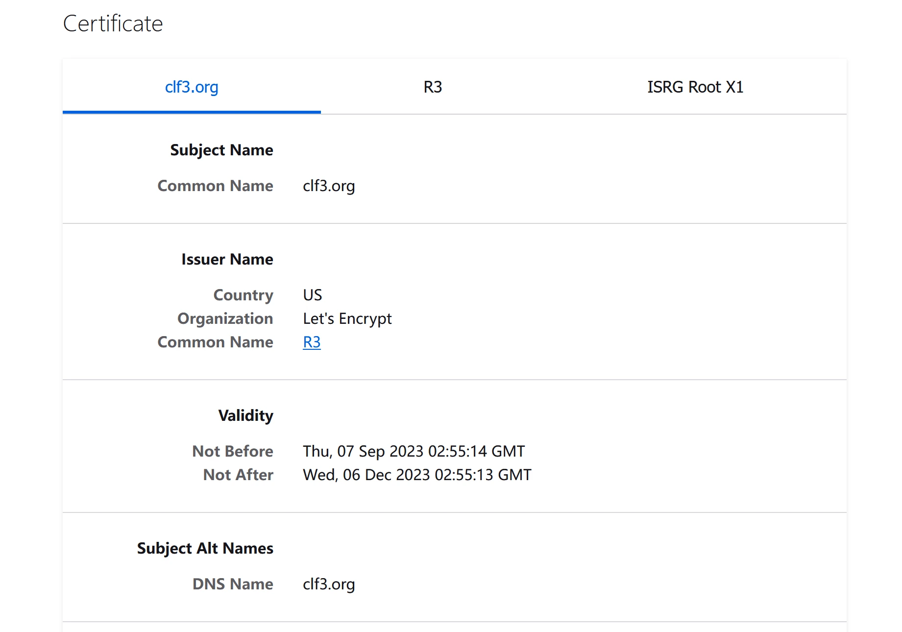

完善了Alist服务之后，我决定给它用上https。但是Alist自己的服务应该不支持直接做https，所以在查阅一番之后我决定用Nginx反代再在nginx上用上https。

Nginx配置文件的结构是http内可以有多个server，相当于多个虚拟的host，每个server又可以有多个的location，我先配置了一个server，让他listen本地的80端口。至于具体如何反代到Alist的5244端口，在Alist官方文档专门列出了配置location的示例代码，我只在示例代码上稍作修改就可以运行了，我使用的location代码如下：

```
location / {
  proxy_set_header X-Forwarded-For $proxy_add_x_forwarded_for;
  proxy_set_header X-Forwarded-Proto $scheme;
  proxy_set_header Host $http_host;
  proxy_set_header X-Real-IP $remote_addr;
  proxy_set_header Range $http_range;
  proxy_set_header If-Range $http_if_range;
  proxy_redirect off;
  proxy_pass http://127.0.0.1:5244;
  # the max size of file to upload
  client_max_body_size 50000m;
}
```

这样配置完成后，我们输入对应IP就可以直接访问我的Alist。但这只是完成了第一步，转发后依然采用的是http服务，下面我就要申请SSL证书，并建立起https的网络服务。

提供证书的是Let’ s encrypt，别问为什么，问就是免费。Let’ s encrypt的certbot还可以让我自动获取证书并用到我的服务器上，我觉得这一点也很好。

我采用的认证方式是DNS认证，也就是创建并删除指定的DNS记录以证明你对整个域名的所有权，这样做的好处主要是可以获得通配符证书，也就是对我的所有子域名都有效的证书。

Certbot官网有针对不同系统和应用的配置教程，我选择了Nginx+Ubuntu 20的项（其实我是Ubuntu 22，但上面没有）。先用snap安装好Certbot，再安装Certbot的Cloudflare插件，这个插件就可以帮助我实现自动更新DNS从而自动获取新的证书。

之后，按照Cloudflare插件的教程，我将我的Cloudflare API key放到了一个文件里供插件调用，接下来就只需要仿照示例的格式尝试获取一次证书：

```bash
certbot \
  --dns-cloudflare \
  --dns-cloudflare-credentials ~/.secrets/certbot/cloudflare.ini \
  -d clf3.org -i nginx
```

之后Certbot会自动获取证书，保存到本地，并改写nginx配置文件使其支持https。观察配置文件发现它自动把我server的listen端口改到443，配置了一些SSL之类的选项，又把80端口重定向到https的443端口。之后我们用https访问服务器IP，就能看到证书，当然，由于用的是IP，此时会提示证书无效，我们只需在路由器里添加一个端口映射就可以通过我的公网域名访问到我的Alist了。

但是我又发现了一个问题，我的服务器只开启了https，但如果仅输入域名和端口号，浏览器默认尝试以http的方式访问，因此只能看到一个错误页面。其实Certbot也考虑到了这一点，所以把服务器的80重定向到了443。但由于我是在路由器上开的端口映射，只能把公网IP的特定端口转到443。这也就导致了浏览器尝试用http访问时，这个http请求也直接被转发到服务器的443端口，而引发错误码497，所以我们只需要把错误码497的错误页面直接改成对应的https的网站页面就可以了：

```
error_page 497 https://$http_host$request_uri
```

然后执行nginx -s reload更新Nginx配置。现在我们就可以在浏览器输入我的域名加上端口，之后就可以直接跳转到对应的https页面了。

我们查看一下证书，也没有任何问题：



这样一来，我的Alist就使用上了https服务，我与服务器之间的连接也就是完全加密的了。

目前为止我的服务器的安全措施虽然不是非常完善，但至少不是一点没有。除了Alist服务使用直接开放端口的方式以外，其他网页服务我都使用了Cloudflare的CDN，从我这里到Cloudflare走的是加密的Tunnel，从Cloudflare再到用户走的是用Cloudflare的证书签名的https，也实现了全程的数据加密。

至于SSH和RDP，我暂时的做法是不用默认端口，改成一个高位的随机端口，这样被扫描到的概率也会小一点，同时设置强密码，正常情况下要靠爆破是很难侵入我的系统的。

目前我在路由器上设置转发的只有Alist端口、MC服务器的两个端口、SSH端口和RDP端口，除此之外一切入站流量都应该是被拒绝的。

当然安全方面我很可能也有没有考虑到的方面，以后想到了再加强吧。